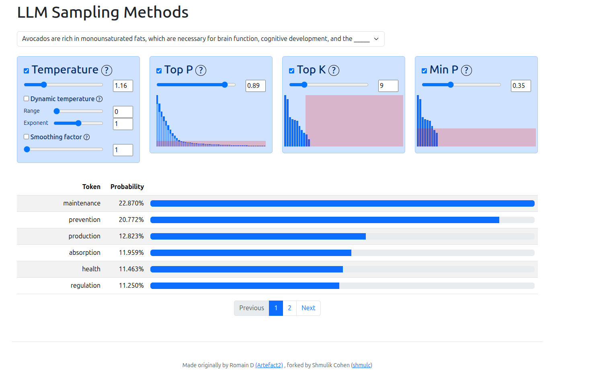

# llm-sampling

An interactive LLM sampling demonstration using llama.cpp with a browser-based visualization.



[**See an online demo here**](https://anuk909.github.io/llm-sampling/web/)

## Supported Sampling Methods

The interactive visualization supports the following token sampling techniques:

- **Temperature** - Scales token probabilities using a power function with optional dynamic temperature based on entropy
- **Top-K** - Keeps only the K highest probability tokens
- **Top-P (Nucleus)** - Keeps tokens until cumulative probability reaches P
- **Min-P** - Filters tokens based on minimum probability relative to the highest probability token

These samplers can be combined and reordered to explore different sampling strategies.

## Requirements

- Python 3.11+
- Docker (for llama.cpp server)

## Quick Start

```bash
# 1. Install dependencies
make setup

# 2. Download a model, you can use any model you want in the GGUF format.
make download-model MODEL=DravenBlack/gemma-3-1b-it-q4_k_m-GGUF

# 3. Start the llama.cpp server (in one terminal), you can use any model you downloaded in the gguf format.
make server MODEL=gemma-3-1b-it-q4_k_m.gguf

# 4. In another terminal, generate completions from prompts
make generate-completions

# 5. View results in your browser
make http-server
# Open http://localhost:8000
```

## Available Commands

| Command                     | Description                                      |
| --------------------------- | ------------------------------------------------ |
| `make setup`                | Install Python dependencies                      |
| `make server`               | Start llama.cpp server with default model        |
| `make http-server`          | Start HTTP server to view results                |
| `make generate-completions` | Generate completions from `prompts.json` prompts |
| `make download-model`       | Download a GGUF model                            |
| `make help`                 | Show all available commands                      |

## Configuration

### Models

Start server with a specific model:

```bash
make server MODEL=gemma-3-1b-it-q4_k_m.gguf
```

Download a new model:

```bash
make download-model MODEL=DravenBlack/gemma-3-1b-it-q4_k_m-GGUF
```

### Input Prompts

Edit `prompts.json` with your prompts:

```json
["Your prompt here", "Another prompt here"]
```

Results are saved to `web/probs.json`.
